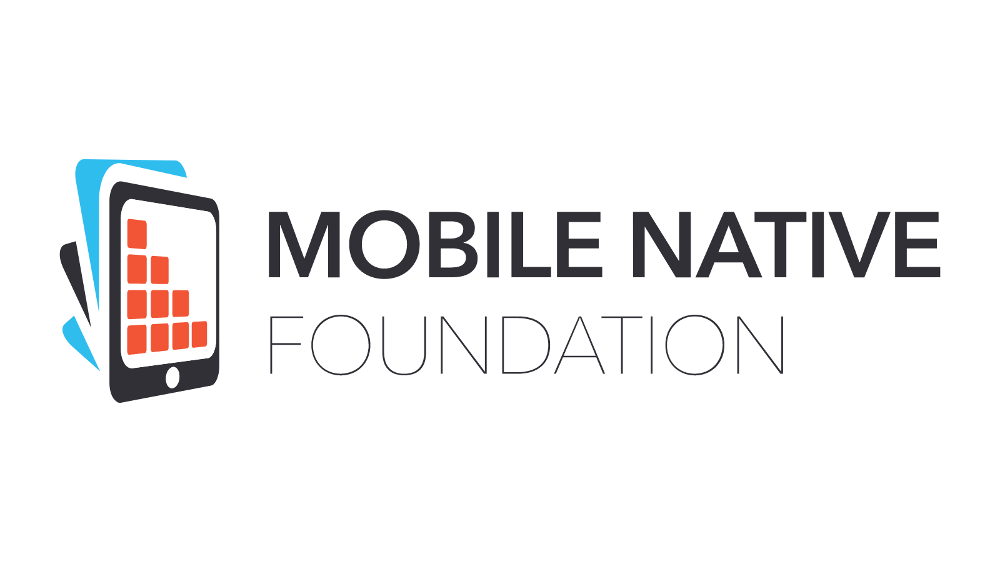
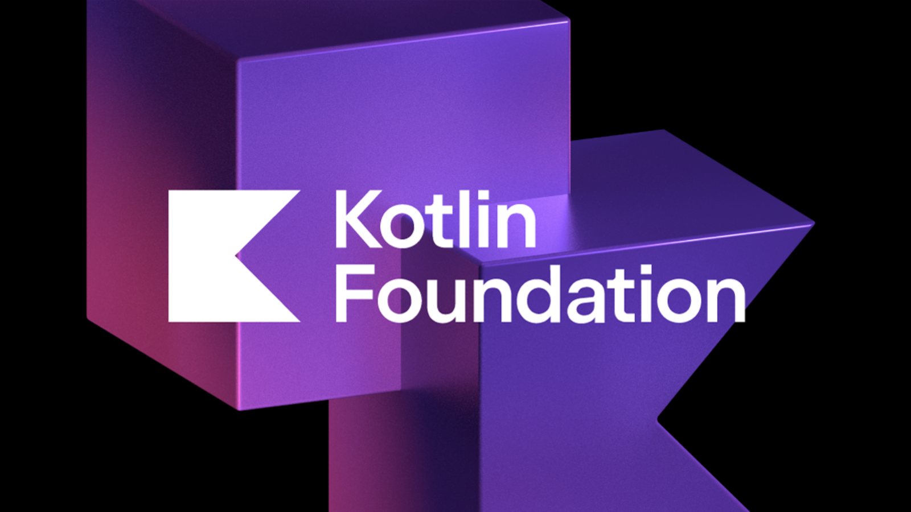

# Store5

[](https://codecov.io/gh/MobileNativeFoundation/Store)

#### Documentation

Comprehensive guides, tutorials, and API reference: [store.mobilenativefoundation.org](https://store.mobilenativefoundation.org).

#### Getting Started

1. Start with the [Quickstart](https://store.mobilenativefoundation.org/docs/quickstart) to build your first Store.
2. Dive into [Store Foundations](https://store.mobilenativefoundation.org/docs/concepts) to learn how Store works.
3. Check out [Handling CRUD](https://store.mobilenativefoundation.org/docs/use-cases/store5/setting-up-store-for-crud-operations) for an advanced guide on supporting create, read, update, and delete operations.

#### Getting Help

Join our community in the [#store](https://kotlinlang.slack.com/archives/C06007Z01HU) channel on the official Kotlin Slack.

#### Getting Involved

Store has a vibrant community of contributors. We welcome contributions of all kinds. Please see our [Contributing Guidelines](CONTRIBUTING.md) for more information on how to get involved.

#### Backed By

<div style="display: flex; align-items: center; gap: 20px;">
    
    
</div>

#### License

```text
Copyright (c) 2024 Mobile Native Foundation.
Licensed under the Apache License, Version 2.0 (the "License");
you may not use this file except in compliance with the License.
```
