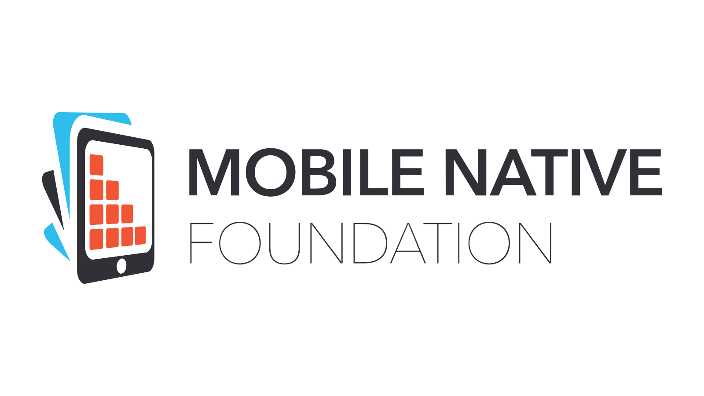
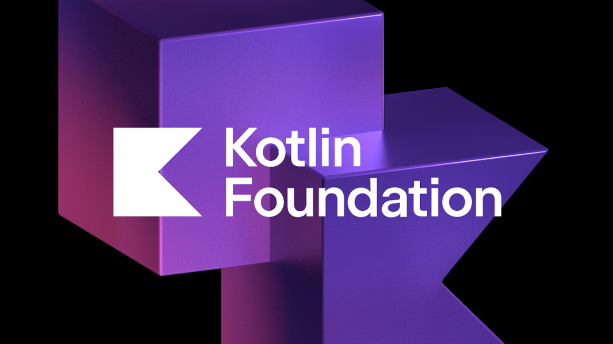

# Store6

[](https://app.codecov.io/gh/matt-ramotar/Store6/tree/store6)

## Store 6

Store 6 is the next major line, using `core`, `testing`, `mutations`, and the other Store 6
artifacts in the `org.mobilenativefoundation.store` group, alongside Store 5 for the whole 6.x major. It is a Kotlin Multiplatform library for reading and writing data that lives in
more than one place: a network, a local database, and memory. You describe a key and a fetcher, and
Store handles single-flighting concurrent demand, staleness, and invalidation, and it bounds engine
residency with a `maxIdleKeys` LRU. Every zero-config behavior is named and covered by a conformance
test you can read; the zero-config in-memory persistence itself is unbounded by design — install a
persistent source of truth and bookkeeper when key cardinality can grow without limit.

**Status: in development, targeting 6.0.0-alpha01.** The alpha artifacts are not yet available
from Maven Central.

Two things about the first alpha, stated up front rather than discovered later:

- **Mutations ship experimental.** `mutations` is a separate artifact and every public symbol
  is `@ExperimentalStoreApi`. The tier is on the artifact, never annotation-gated inside a stable
  one.
- **Mutations ship the two-step durable ack posture.** The non-transactional acknowledgement path
  records `ACKED` durably before adopting the server echo and retires the journal row last.
  Process-death recovery requires durable journal storage; the default is in memory.
  Recovery from durable `ACKED` resumes adoption and effects without another push. A crash before
  that receipt is durable can cause the push to be re-sent with the same idempotency key; endpoints
  must treat it as the same request. Atomic journal/source acknowledgement is beta01 work.

The full policy — API tiers, the deprecation cycle, the cadence commitment, and how you can verify
all of it from a released tag — is in [STABILITY.md](./STABILITY.md). The public roadmap is at
[ROADMAP.md](./ROADMAP.md), and the quickstart is at
[docs/store6/quickstart.md](./docs/store6/quickstart.md).
The [platform matrix](docs/store6/platforms.md) lists declared targets and the scope of completed
verification.
The Swift Package Manager facade is deferred from this alpha. Local development instructions are in
[store6-swift/README.md](./store6-swift/README.md).

---

#### Documentation

Comprehensive guides, tutorials, and API reference: [store.mobilenativefoundation.org](https://store.mobilenativefoundation.org).

#### Getting Started

1. Start with the [Quickstart](https://store.mobilenativefoundation.org/docs/quickstart) to build your first Store.
2. Dive into [Store Foundations](https://store.mobilenativefoundation.org/docs/concepts) to learn how Store works.
3. Check out [Handling CRUD](https://store.mobilenativefoundation.org/docs/use-cases/store5/setting-up-store-for-crud-operations) for an advanced guide on supporting create, read, update, and delete operations.

#### Getting Help

Join our community in the [#store](https://kotlinlang.slack.com/archives/C06007Z01HU) channel on the official Kotlin Slack.

#### Getting Involved

Store has a vibrant community of contributors. We welcome contributions of all kinds. Please see our [Contributing Guidelines](CONTRIBUTING.md) for more information on how to get involved.

#### Backed By

<div style="display: flex; align-items: center; gap: 20px;">
    
    
</div>

#### License

```text
Copyright (c) 2024 Mobile Native Foundation.
Licensed under the Apache License, Version 2.0 (the "License");
you may not use this file except in compliance with the License.
```
